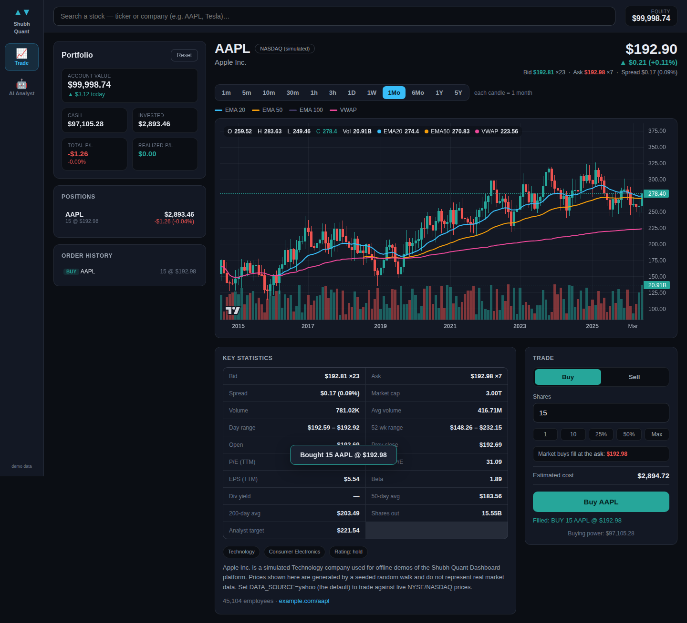
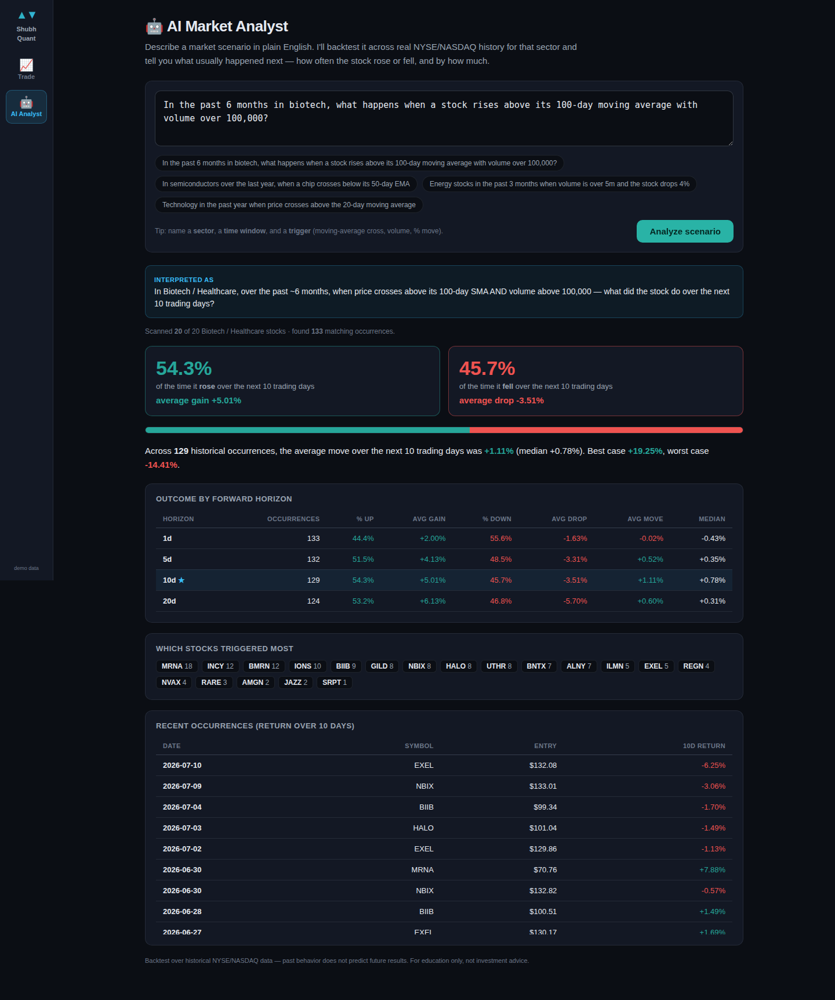

# 📈 Shubh Quant Dashboard — NYSE & NASDAQ Simulator

A self-hosted **quant dashboard** with two workspaces, switchable from the side
rail:

- **📈 Trade** — a paper (virtual-money) trading simulator. Search any NYSE or
  NASDAQ stock, study a real interactive chart with **volume, VWAP and
  20 / 50 / 100 EMAs**, review fundamentals like **market cap, P/E and 52-week
  range**, then practice **buying and selling with a $100,000 paper account**.
- **🤖 AI Analyst** — describe a market scenario in plain English and it
  backtests it across real history, reporting **how often the stock rose or fell
  next, and by how much**. You control everything from the prompt:
  - **A single stock or a whole sector** — "Analyze NVDA…", "$TSLA…", "Apple…", or "in biotech…".
  - **The lookback window** — "over the past 2 years", "in the last 6 months", "past 90 days".
  - **The forward horizon** — from **"over the next 30 minutes"** or "next hour"
    up to "over the next 20 days" / "held for 2 weeks" / "next 5 years". A
    sub-daily horizon runs the whole analysis on 30-minute intraday bars
    (~30-day window; MA periods and volume are then per 30-minute bar).
  - **The trigger** — moving-average crosses, volume thresholds, single-day % moves.

  Example: *"Analyze NVDA over the past 2 years — when it crosses above its
  50-day EMA, what happens over the next 20 days?"* → % up / avg gain, % down /
  avg drop across several forward horizons.
- **🦾 AI Trader** — an algorithmic trader that runs on the **same paper account
  as the Trade tab** and trades **only** the patterns you give it. Find a scenario
  you like in the AI Analyst and hit **“Add this pattern to the AI Trader”**; from
  that moment on it buys when the pattern triggers and sells after the pattern's
  forward horizon. Its orders spend the shared cash, open real positions, and
  appear in the Trade tab's order history (badged **AI**). The AI Trader tab lists
  every active pattern with its win rate and P/L, and the full trade log. Toggle a
  pattern off or remove it and its open positions are liquidated.

- **🧠 AI Strategist** — backtests a library of market patterns across a universe,
  scores each by **reward vs risk** (average forward return ÷ its volatility, a
  Sharpe-like score), ranks them on a leaderboard, and **auto-applies the best
  ones to your paper portfolio** by promoting them into the AI Trader. Only
  patterns with enough occurrences and positive expectancy qualify.

No real money, no brokerage account, no API keys.




## Features

- **Live NYSE / NASDAQ data** pulled from Yahoo Finance (real, ~15-min delayed
  prices) — no API key required.
- **Interactive candlestick charts** (TradingView Lightweight Charts) with
  selectable timeframes: 1D · 5D · 1M · 6M · 1Y · 5Y.
- **Technical indicators**, each individually toggleable:
  - Volume histogram
  - VWAP (session-anchored intraday, range-anchored for daily)
  - EMA 20 / EMA 50 / EMA 100
  - Live OHLC + indicator legend that follows your cursor.
- **Fundamentals panel:** market cap, volume & average volume, day range,
  52-week range, open, previous close, P/E (trailing & forward), EPS, beta,
  dividend yield, 50/200-day averages, shares outstanding, analyst target,
  plus sector, industry and a company description.
- **Paper trading engine:**
  - $100,000 starting cash (persisted between restarts).
  - Market Buy / Sell **filled at the live price** (never a client-supplied one).
  - Quick-size buttons (10, 25%, 50%, Max / All).
  - Positions marked to market with unrealized P/L, realized P/L, day change,
    total return and an order blotter.
  - One-click account reset.
- **Search restricted to NYSE & NASDAQ equities** (other exchanges are filtered
  out).
- **Offline demo mode** with synthetic data so the app runs anywhere.

## Quick start

```bash
npm install     # installs deps and vendors the chart library
npm start       # serves on http://localhost:3000
```

Then open <http://localhost:3000> and start trading.

### Offline / demo mode

If you're on a network that blocks Yahoo Finance (or just want a deterministic
demo), run with synthetic data — clearly labelled "(simulated)" in the UI:

```bash
DATA_SOURCE=mock npm start
```

## Configuration

| Env var         | Default              | Description                                                   |
| --------------- | -------------------- | ------------------------------------------------------------ |
| `PORT`          | `3000`               | HTTP port.                                                   |
| `DATA_SOURCE`   | auto                 | `polygon`, `yahoo`, or `mock`. Defaults to `polygon` when a key is set, else `yahoo`. |
| `POLYGON_API_KEY` | —                  | Polygon.io key (put it in `.env`). Enables real quotes + deep history. |
| `POLYGON_INTRADAY_MAX_DAYS` | `730`    | How far back your Polygon plan serves 30-min intraday.       |

### Market-data providers

The backend talks to a pluggable provider (`server/index.js` → `SOURCE`):

- **`polygon`** — real NYSE/NASDAQ quotes (bid/ask, market cap, day range) and deep
  history for multi-year intraday backtests. **You must create a `.env` file** (it's
  gitignored, so it never ships with the repo):
  ```bash
  cp .env.example .env          # then edit .env and paste your key
  # or in one line:
  echo "POLYGON_API_KEY=your_key_here" > .env
  npm start                     # startup log should read: source = polygon
  ```
  With a key present, Polygon becomes the default source; the **quote endpoint,
  trade fills and charts all use Polygon**. If a Polygon call fails (rate limit,
  plan limit, network) it **falls back to Yahoo automatically**, so the app never
  breaks. `.env` is gitignored — your key is never committed. If the log still says
  `source = yahoo`, your `.env` is missing or in the wrong folder (it must sit next
  to `package.json`).
- **`yahoo`** — free, no key, ~15-min delayed, ~60-day intraday limit.
- **`mock`** — offline synthetic data (multi-year intraday works here for demos).

## How it works

```
server/
  index.js      Express API + static file server
  yahoo.js      Live Yahoo Finance client (cookie/crumb handshake + caching)
  mock.js       Synthetic provider (same interface) for offline mode
  portfolio.js  Paper-trading account, persisted to data/portfolio.json
public/
  index.html    Single-page UI
  js/app.js     UI logic (search, detail, trading, portfolio)
  js/chart.js   Lightweight-Charts wiring (candles, volume, overlays)
  js/indicators.js  Pure EMA / SMA / VWAP math
  css/styles.css
```

### API

| Method | Endpoint                 | Purpose                                  |
| ------ | ------------------------ | ---------------------------------------- |
| GET    | `/api/search?q=`         | NYSE/NASDAQ symbol search                |
| GET    | `/api/quote/:symbol`     | Quote + fundamentals                     |
| GET    | `/api/chart/:symbol?tf=` | OHLCV bars (`tf` = 1D…5Y)                |
| GET    | `/api/portfolio`         | Account marked to live prices            |
| POST   | `/api/trade`             | `{ side, symbol, shares }` — market order|
| POST   | `/api/portfolio/reset`   | Reset to $100k cash                      |
| GET    | `/api/sectors`           | Sector universes for the AI Analyst      |
| POST   | `/api/analyze`           | `{ query }` — backtest a plain-English scenario |
| GET    | `/api/aitrader`          | AI Trader account, patterns and trade log |
| POST   | `/api/aitrader/strategies` | `{ scenario }` — add a pattern to the AI Trader |
| POST   | `/api/aitrader/strategies/:id/toggle` | Enable/disable a pattern         |
| DELETE | `/api/aitrader/strategies/:id` | Remove a pattern                     |

### AI Analyst — how it works

The scenario engine is deterministic (not an LLM), so it always shows exactly how
it read your request and every field is overridable:

1. **`scenario.js`** parses the query into `{ sector, lookback, conditions[], horizons }`
   using keyword/regex rules (moving-average crosses, volume thresholds, % moves).
2. **`universe.js`** maps the sector to a curated list of ~20 liquid NYSE/NASDAQ tickers.
3. **`backtest.js`** fetches daily history for each name, finds every day all
   conditions fire, measures forward returns at 1/5/10/20-day horizons, and
   returns the full occurrence list.

Every occurrence is listed and interactive: **click a row** to open a chart of
that stock around the trigger (with the relevant moving average, a Trigger
marker at entry and the exit N days later), or hit **×** to remove it — the
verdict, horizon table and averages recompute instantly (client-side), with
"restore all" to bring removed occurrences back.

### Testing

```bash
npm i --no-save playwright
DATA_SOURCE=mock PORT=3111 npm start &     # in one shell
node scripts/smoke.mjs shot.png            # end-to-end browser check
```

## Intraday data & multi-year intraday backtests

Sub-daily analysis (a forward horizon under a day, or an opening-range trigger like
"first 30 minutes") runs on **30-minute bars**. How far back that can reach depends
on the data source, declared by each provider's `INTRADAY_MAX_DAYS`:

- **`yahoo` (default, live):** Yahoo's free feed serves only ~**60 days** of
  30-minute bars, so intraday windows are limited to that (with a warning). A true
  multi-year *intraday* backtest isn't possible from this source.
- **`mock` (demo):** synthetic data has no history limit, so **multi-year intraday
  backtests work out of the box** — e.g. *"over the past 2 years, in the first 30
  minutes, if a stock's initial move is +5%…"* scans two full years of 30-minute bars.

To do multi-year intraday on **real** data, plug in a provider that serves deep
intraday history (e.g. Alpaca, Polygon, or Tiingo). Add a module with the same
interface as `server/yahoo.js` (`chart`, `quote`, `lastPrice`, `search`, and an
`INTRADAY_MAX_DAYS` export), then select it in `server/index.js`. The clamp and
warnings adjust automatically to whatever `INTRADAY_MAX_DAYS` the provider reports.

## Notes & disclaimer

- Market data is provided by Yahoo Finance's public endpoints and is typically
  **delayed ~15 minutes**. This is intended for education and practice only.
- Fills are simulated at the last trade price with **no slippage, spread,
  commission, or market-hours restriction** — real execution differs.
- **Not investment advice.** This project is for learning and entertainment.

## License

MIT
